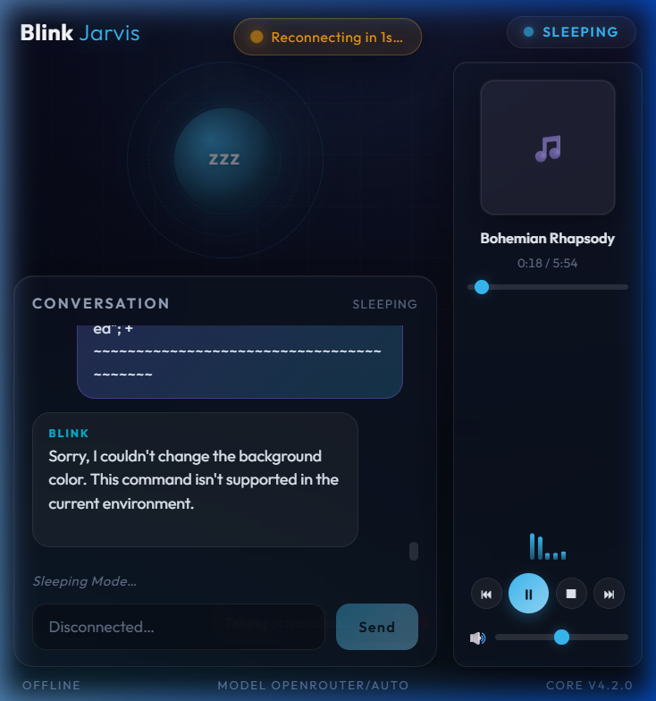

# Blink — Local Voice & Text Assistant (v4.2.0)

Blink is a Jarvis-style desktop assistant: a glassmorphic React HUD backed by a FastAPI service that does wake-word detection, speech-to-text, text-to-speech, local system control, music playback, and LLM-driven command orchestration through OpenRouter.

It features a pixel-perfect, premium dark glassmorphic layout, designed to sit on your desktop as a cyberpunk dashboard widget.

---

## Interface Preview

Here is the Blink interface running in desktop HUD mode with the side-by-side vertical media player:



---

## Key Features

### 💻 Glassmorphic Cyberpunk HUD
* **HUD Overlay**: Seamless, frameless, and draggable window using `pywebview` with a gorgeous glassmorphic look.
* **Dynamic Accent Color**: The interface glow and accent highlights transition dynamically based on assistant status (`SLEEPING`, `BOOTING`, `LISTENING`, `PROCESSING`, `SPEAKING`).
* **Visualizer Orb centerpiece**: Breathing orb for idle states and responsive, imperative scale-easing to represent microphone audio levels in real time.

### 🎤 Interactive Speech Pipeline
* **Wake-word detection**: Listens locally for the `"Hey Jarvis"` wake word.
* **Speech-to-Text (STT)**: High-precision speech recognition utilizing the `faster-whisper-base` engine.
* **Text-to-Speech (TTS)**: Realistic local speech synthesis using the Kokoro ONNX engine with automatic, graceful fallback to `pyttsx3` offline TTS if models are loading or unavailable.

### 🎵 Vertical Sidebar Media Player
* **Search Playlist Caching**: Searches YouTube for up to 10 matching results (`ytsearch10`) into an internal playlist.
* **Transport Controls**: Skips tracks (`⏮` and `⏭`), pauses/resumes (`▶`/`⏸`), and stops (`⏹`) playback without waiting for LLM dispatch.
* **Horizontal Volume & Seek Sliders**: Real-time position tracking and seek control.
* **Equalizer Animation**: A responsive bouncing bar equalizer visualizer representing active playback states.
* **Smart Column Layout**: Automatically slots in as a vertical sidebar on the right when music starts, and vanishes when stopped, preserving the dikey conversation scroll feed.

### 🛡️ System Control & Safety Policy
* **Telemetry Monitors**: Readouts for CPU usage, RAM utilization, Disk space, and Battery charging status.
* **System Commands**: Voice commands to adjust system volume, control screen brightness, toggle Wi-Fi and Bluetooth, lock the workstation, sleep, restart, or shutdown.
* **Multi-Monitor Screenshots**: Multi-display virtual screen captures using Windows GDI, fully aware of DPI scaling boundaries.
* **Safety Sandbox**: Command execution is disabled by default and runs sanitized shell executions without string interpolation.

---

## Architecture

```
assets/              Promotional assets and screenshots
frontend/            React + Vite glassmorphic HUD (served by FastAPI in prod)
main.py              Entry point: desktop (pywebview) or --headless (Docker)
src/
  server.py          FastAPI app: /ws control plane, /ws/audio ingest, /health
  config.py          pydantic-settings configuration + security policy
  schemas.py         pydantic models validating every trust boundary
  ai.py              OpenRouter client + context manager (offline-aware)
  system.py          Hardened OS control (injection-safe, gated execution)
  scanner.py         Workspace / installed-app scanner with caching
  database.py        Thread-safe SQLite: memory + persistent conversation
  utils.py           Structured logging + networking helpers
  audio/
    wake_word.py     BackendWorker thread: wake word + command loop
    speech.py        STT (faster-whisper) + TTS (Kokoro, pyttsx3 fallback)
    music.py         Streaming music engine
tests/               pytest suite (config, schemas, ai, system, database)
```

---

## Quick Start (Desktop HUD)

```bash
# 1. Copy environment example and configure your OpenRouter API Key
cp .env.example .env

# 2. Run the platform-specific boot script
# On Linux/macOS:
./scripts/run.sh

# On Windows (PowerShell):
powershell -File scripts\run.ps1
```

You can also paste the API key directly into the in-app **Setup** panel on first launch.

---

## Headless / Docker Mode

Since `pywebview` cannot render graphical windows inside headless containers, Blink can be run in headless mode. The browser interface will stream microphone audio back to the container over the `/ws/audio` WebSocket.

```bash
# Start via Docker Compose
docker compose up --build
# Open http://localhost:8000 in your browser.
```

Or without Docker Compose:

```bash
docker build -t blink-assistant:4.2.0 .
docker run --rm -p 8000:8000 -e OPENROUTER_API_KEY=sk-or-... blink-assistant:4.2.0
```

To run headless locally (no Docker):

```bash
python main.py --headless
```

---

## Configuration Settings

All configurations are driven by environment variables defined in `.env.example`:

| Variable | Default | Purpose |
| --- | --- | --- |
| `OPENROUTER_API_KEY` | _(empty)_ | Required to enable the OpenRouter LLM. |
| `OPENROUTER_MODEL` | `openrouter/auto` | Command translation model. |
| `BLINK_HOST` / `BLINK_PORT` | `127.0.0.1` / `8000` | Bind network address and port. |
| `BLINK_HEADLESS` | `0` | `1` = Start API only, bypass desktop window. |
| `BLINK_ENABLE_CODE_EXECUTION` | `0` | `1` = Allow AI-generated script execution. |
| `BLINK_COMMAND_TIMEOUT` | `10` | Max seconds allowed per generated command. |
| `BLINK_WS_TOKEN` | _(auto)_ | Token gating privileged WebSocket actions. |
| `BLINK_ALLOWED_ORIGINS` | localhost set | CORS / WS origin restriction allowlist. |
| `BLINK_LOG_LEVEL` / `BLINK_LOG_JSON` | `INFO` / `0` | Logging verbosity and JSON format output. |

---

## Security Notes

1. AI command execution is **disabled by default**. When enabled, commands are parsed into arguments instead of shell strings to avoid injection attacks.
2. Privileged WebSocket actions (`system_action`, `save_config`) are protected by a cryptographically generated token.
3. CORS is limited to allowed domains (wildcards are blocked).
4. Docker images drop root privileges and run under a secure user group.

---

## Running Automated Tests

To verify code changes and integration flows:

```bash
pip install -r requirements-dev.txt
pytest
```
